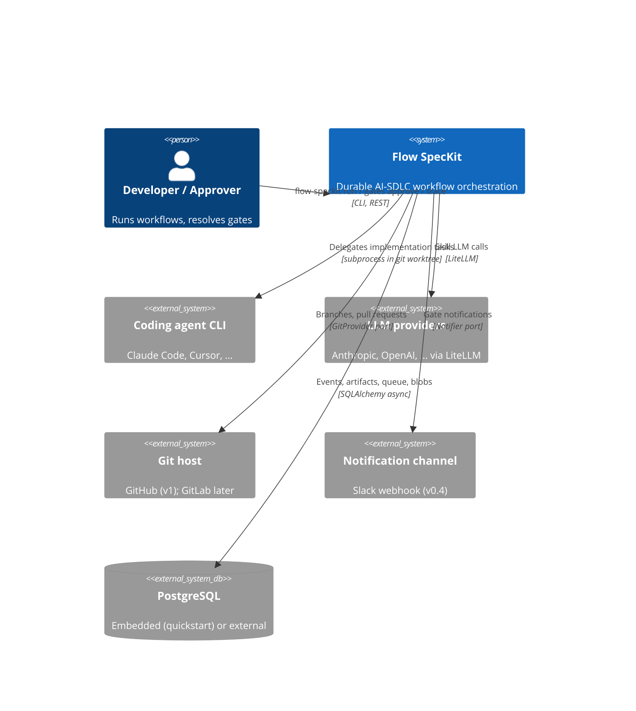
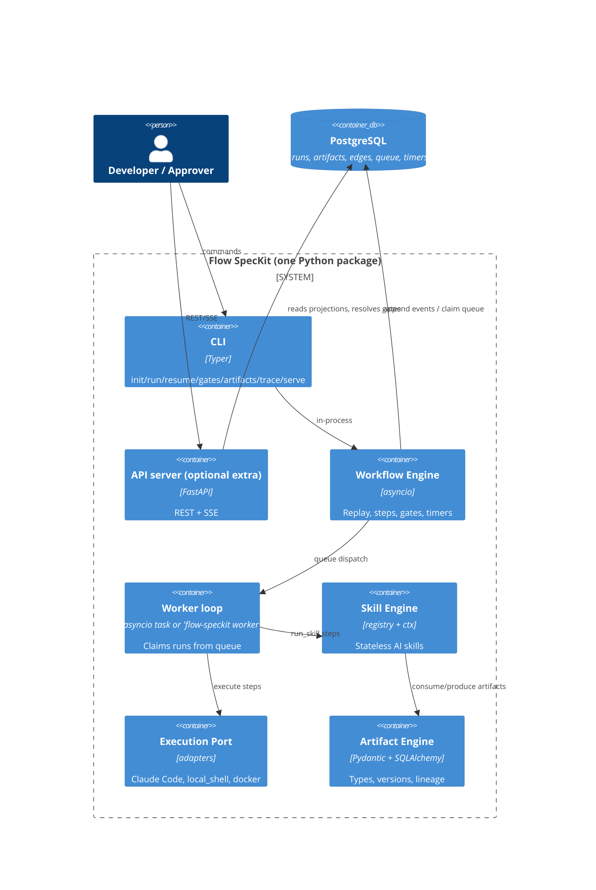
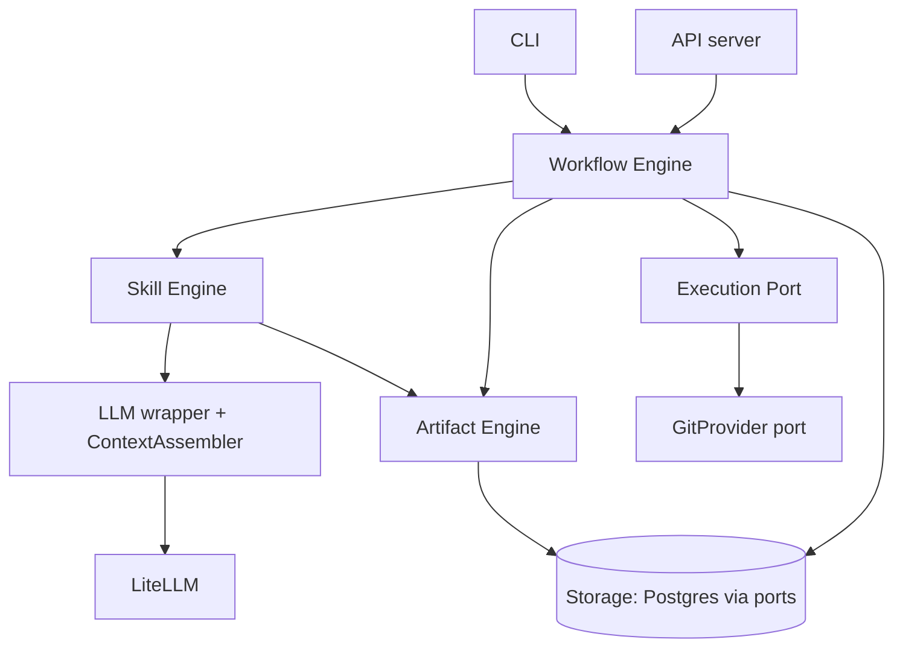

# 01 — Architecture Overview

> How the kernel is bounded, how plugins attach, and how the codebase is laid out.
> Detailed designs live in docs 02–07; this doc is the map.

## 1. System context (C4 level 1)



Flow SpecKit sits between humans and their tools: it never talks to a repository or an LLM
except through a port, and it never makes a decision a gate has reserved for a human.

## 2. Container view (C4 level 2)



Key property: **the CLI mode and the server mode are the same code.** In CLI mode the
worker is an in-process asyncio task and gates resolve from a second terminal; in server
mode (`v0.4`) the identical engine runs behind `flow-speckit server` + N × `flow-speckit worker`
against shared Postgres. Dispatch is Postgres-native from day one, so scaling out is a
deployment change, not a code change.

## 3. Kernel boundaries

| Subsystem | Owns | Must not know about |
|---|---|---|
| **Artifact Engine** (doc 02) | Artifact types, versioning, edges, validation, diff, materialization | Workflows, skills, LLMs |
| **Workflow Engine** (doc 03) | Event log, replay/memoization, gates, timers, queue, run projections | Artifact *semantics*, LLM providers, git |
| **Skill Engine** (doc 04) | `@skill` contract, registry, `SkillContext`, testing harness | Workflow internals, execution backends |
| **Execution Port** (doc 05) | `ExecutionBackend` protocol, workspace lifecycle, result capture | Which skill produced the task plan |
| **LLM wrapper + ContextAssembler** (doc 06) | Tier routing, cost metering, artifact context packing | Everything else |

Dependency direction (arrows = "may import"):



The Artifact Engine imports nothing from the Workflow Engine; a future "artifacts as a
library without workflows" use is preserved.

## 4. Ports & adapters map

Hexagonal boundaries exist **only** where a real substitution need exists. No DI
framework; ports are Python `Protocol`s resolved from config + entry points at startup.

| Port | Kernel default | Plugin adapters |
|---|---|---|
| `ExecutionBackend` | `local_shell`, `docker` (in-core) | `flow-speckit-backend-claude-code` (v0.1), `flow-speckit-backend-cursor` (v0.3) |
| `GitProvider` | local git operations | `flow-speckit-github` (PRs, reviews-as-gates), GitLab later |
| `BlobStore` | Postgres `blobs` table | `flow-speckit-storage-s3` (post-v1 if demanded) |
| `VectorStore` | none (unused in v0.1) | pgvector extra, Qdrant plugin (if ever) |
| `Notifier` | terminal bell / no-op | `flow-speckit-notify-slack` (v0.4), email |
| `LLMClient` | LiteLLM wrapper | swap seam if LiteLLM's weight ever becomes a problem |

Everything else — engine, artifact store, queue — is concrete Postgres-backed code.
Ports have costs (indirection, conformance testing); we pay only where the roadmap
proves substitution.

## 5. Repository layout (uv workspace)

```
/framework
├── pyproject.toml                  # uv workspace root; ruff/mypy/pytest config
├── packages/
│   ├── flow-speckit/               # THE core kernel — the only required install
│   │   ├── pyproject.toml          # extras: [server], [pgvector], [embedded-pg]
│   │   └── src/flow_speckit/
│   │       ├── artifacts/          # models.py, store.py, graph.py, diff.py,
│   │       │                       # registry.py, materialize.py
│   │       ├── workflows/          # engine.py, context.py (WorkflowContext),
│   │       │                       # events.py, gates.py, timers.py, queue.py,
│   │       │                       # dsl.py (@workflow), yaml_loader.py
│   │       ├── skills/             # base.py (@skill, SkillContext), registry.py,
│   │       │                       # testing.py
│   │       ├── execution/          # base.py (port + task/result models),
│   │       │                       # workspace.py, local_shell.py, docker.py,
│   │       │                       # testing.py (conformance suite)
│   │       ├── llm/                # client.py (LiteLLM wrapper), tiers.py, cost.py,
│   │       │                       # assemble.py (ContextAssembler)
│   │       ├── git/                # provider.py (GitProvider port), local.py
│   │       ├── storage/            # db.py, blobs.py, migrations/ (alembic)
│   │       ├── server/             # FastAPI app, routes/, sse.py        [extra]
│   │       ├── cli/                # Typer app, one module per command group
│   │       ├── config.py           # flow-speckit.toml via pydantic-settings
│   │       └── plugins.py          # entry-point discovery, all groups
│   ├── flow-speckit-backend-claude-code/
│   ├── flow-speckit-backend-cursor/            # v0.3
│   ├── flow-speckit-github/                    # GitProvider adapter
│   ├── flow-speckit-notify-slack/              # v0.4
│   ├── flow-speckit-skills-product/            # frame, research, shaping skills
│   └── flow-speckit-skills-engineering/        # design, task-planning, review skills
├── templates/                      # full-sdlc.yaml, feature.yaml, bugfix.yaml,
│                                   # review-only.yaml
├── examples/
│   ├── quickstart/                 # THE 5-minute path; kept green by CI
│   └── custom-skill/
├── docs/                           # this design set; later mkdocs-material site
├── deploy/                         # docker-compose.yml, k8s.yaml (v0.4)
└── .github/workflows/              # ci.yaml, nightly-conformance.yaml
```

Rules of the monorepo:

- `packages/flow-speckit` never imports from sibling packages; siblings import `flow_speckit`.
- Skill packs and adapters version and release independently of core (vendor-CLI churn
  must never force a core release).
- `examples/quickstart` is executed by CI — the 5-minute path is a test, not a promise.

## 6. Plugin system

The entire plugin mechanism is **Python entry points** — no custom loader, no manifest
server, no marketplace. `flow_speckit.plugins` scans these groups at startup:

| Entry-point group | Registers | Contract defined in |
|---|---|---|
| `flow_speckit.skills` | `@skill` functions | doc 04 |
| `flow_speckit.artifacts` | Pydantic artifact types | doc 02 |
| `flow_speckit.workflows` | `@workflow` functions / template YAML | doc 03 |
| `flow_speckit.backends` | `ExecutionBackend` implementations | doc 05 |
| `flow_speckit.git_providers` | `GitProvider` implementations | doc 05 §6 |
| `flow_speckit.notifiers` | `Notifier` implementations | doc 03 §6 |
| `flow_speckit.storage` | `BlobStore` / `VectorStore` implementations | ADR-0003 |

Plus **project-local discovery**: `./skills/*.py` and `./workflows/*.{py,yaml}` in the
target repo are auto-loaded, so a team's first custom skill requires zero packaging.

Third-party checklist (documented in v0.2): implement the protocol, pass the relevant
conformance/testing harness, declare the entry point, publish to PyPI. `flow-speckit skills
list` / `flow-speckit backends list` show provenance (package, version) for everything
loaded.

## 7. Cross-cutting concerns

- **Configuration** — `flow-speckit.toml` at repo root (committed) + `~/.config/flow-speckit/` +
  env vars (`FLOW_SPECKIT_DATABASE_URL`, provider keys); pydantic-settings; secrets never in
  committed config.
- **Observability** — structlog JSON logs carrying `run_id`/`step_key`/`artifact_id`;
  per-step token/cost columns in the event payloads (doc 06 §4); OTel spans at v0.5
  following GenAI semantic conventions. Viewers are other people's products.
- **Audit** — the workflow event log *is* the audit trail (append-only, actor-stamped
  gate events, artifact references). No separate governance module.
- **Migrations** — Alembic from the first table; artifact `schema_version` per type with
  documented upgrade policy (doc 02 §3).
- **Testing strategy** — unit tests per subsystem; golden replay tests + crash-injection
  (kill worker between side-effect and checkpoint) for the engine from week one;
  conformance suites for backends and skills; `examples/quickstart` as the end-to-end
  smoke test. CI = lint (ruff), types (mypy strict on kernel), tests; nightly job runs
  adapter conformance against real vendor CLIs.
