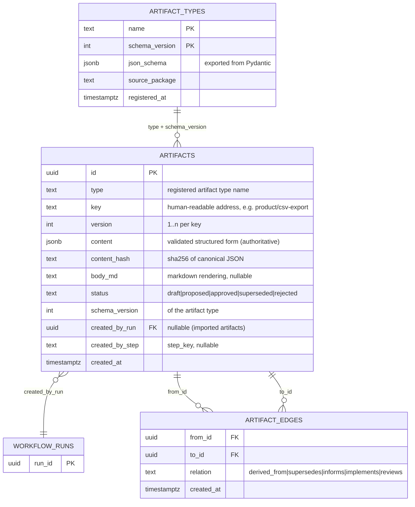

# 02 — Artifact Engine

> Artifacts are the source of truth. This doc defines their type system, storage,
> versioning, lineage graph, diffing, and git materialization.
> Related ADRs: [0005 — system of record](adr/0005-artifact-system-of-record.md).

## 1. Concepts

An **artifact** is an immutable, versioned, schema-validated record produced by a
workflow step (or imported by a human). Examples: a FrameBrief, a TechnicalDesign, the
CodeChange representing an implementation diff.

- Artifacts are **never updated in place**. A revision is a new row with `version + 1`
  and a `supersedes` edge to its predecessor.
- Every artifact knows **which run and step produced it** — provenance is structural,
  not annotated.
- Artifacts form a **DAG** via typed edges; `flow-speckit trace` is a recursive walk of that
  DAG.

## 2. Data model (ER)



Constraints: `UNIQUE (key, version)`; `UNIQUE (from_id, to_id, relation)`; edges are
insert-only; `content_hash` indexed for dedup/integrity checks.

Addressing: `<key>@<version>` (e.g. `design/csv-export@3`); bare `<key>` resolves to the
latest non-rejected version. UUIDs remain the join keys.

## 3. Type system

An artifact type is a **Pydantic v2 model** subclassing `ArtifactModel`, registered via
the `flow_speckit.artifacts` entry-point group (or project-local discovery):

```python
from flow_speckit.artifacts import ArtifactModel, Field

class TechnicalDesign(ArtifactModel, artifact_type="technical_design", schema_version=1):
    title: str
    summary: str = Field(description="One-paragraph design summary")
    context: str
    decisions: list[DesignDecision]
    alternatives_considered: list[Alternative]
    risks: list[Risk]
    open_questions: list[str] = []

    def render_md(self) -> str: ...   # optional; default renderer walks the fields
```

- On registration the JSON Schema is exported into `artifact_types`, giving REST clients
  and non-Python tooling validation/introspection without Python.
- **Schema evolution:** bumping `schema_version` requires an upgrade function
  `migrate_v1_to_v2(content: dict) -> dict` registered alongside the type. Old rows are
  never rewritten; they are upgraded on read (lazy) and the store records both versions
  in `artifact_types`. Post-1.0 schemas freeze under a compatibility contract.
- **Validation is at the boundary:** the store validates `content` against the schema on
  write; skills receive typed models, not dicts.

### Core artifact types (shipped with the kernel + skill packs)

| Type | Produced by | Consumed by | Essence |
|---|---|---|---|
| `FrameBrief` | frame skill (from raw idea) | shaping | Problem, motivation, constraints, success criteria |
| `ProductArtifact` | product-shaping skill | design | Shaped solution: scope, MVP cut, acceptance criteria, risks |
| `TechnicalDesign` | architecture skill | task planning | Design decisions, alternatives, risks |
| `TaskPlan` | task-planning skill | execution step | Ordered implementation tasks with per-task acceptance checks |
| `CodeChange` | execution step (backend result) | review skill, PR step | Branch, commits, diff blob ref, backend logs ref, cost |
| `PullRequestArtifact` | PR-opening step | trace/release | PR URL/number, base/head, state |
| `ReviewReport` | review skill | gates, humans | Findings, severities, verdict |
| `ReleaseNotes` | release skill (v0.2+) | humans | Human-readable change summary |
| `GenericArtifact` | anyone | anyone | `title` + markdown `body` + freeform `metadata` — the ceremony escape hatch |

`GenericArtifact` exists so teams can adopt the workflow discipline before modeling
their documents; graduating a GenericArtifact to a typed artifact is a documented
pattern, not a migration crisis.

## 4. Dual representation: content + body_md

- `content` (JSONB) is **authoritative**: validated, queryable, diffable.
- `body_md` is the human rendering, produced by `render_md()` at write time. It is what
  `flow-speckit artifacts show` prints, what gate notifications embed, what PR descriptions
  quote, and what materializes into the repo (§7). Regenerable at any time; never parsed
  back.

## 5. Lineage graph

Edge taxonomy (closed set; extending it is a schema decision, not a convention):

| Relation | from → to | Meaning |
|---|---|---|
| `derived_from` | output → input | Produced by a step that consumed the target |
| `supersedes` | v(n+1) → v(n) | New version replaces old |
| `informs` | reference → consumer | Non-primary input (e.g. a prior design consulted) |
| `implements` | CodeChange → TaskPlan | Code realizes plan |
| `reviews` | ReviewReport → CodeChange | Review targets change |

The engine wires `derived_from` edges automatically from declared skill inputs
(doc 04 §3); `supersedes` is wired by the store on version bump; `implements`/`reviews`
by the respective step types. Skills never write edges by hand.

Query patterns (single recursive CTEs, no graph DB — see ADR-0003):

```sql
-- Full provenance of an artifact (flow-speckit trace)
WITH RECURSIVE lineage AS (
    SELECT e.from_id, e.to_id, e.relation, 1 AS depth
    FROM artifact_edges e WHERE e.from_id = :artifact_id
    UNION ALL
    SELECT e.from_id, e.to_id, e.relation, l.depth + 1
    FROM artifact_edges e JOIN lineage l ON e.from_id = l.to_id
    WHERE l.depth < 32
)
SELECT * FROM lineage;
```

Impact analysis ("everything downstream of design X") is the same CTE walked in the
opposite direction. Depth in practice is < 20; scale is thousands–millions of edges —
comfortably Postgres territory.

## 6. Diffing

- **Structured diff:** canonical-JSON comparison between two versions' `content`
  (DeepDiff), rendered as a field-level change table — this is the review surface for
  "what changed between design v2 and v3 after gate feedback".
- **Text diff:** unified diff of `body_md` for humans who think in prose.
- `flow-speckit artifacts diff design/csv-export@2 design/csv-export@3` shows both.

## 7. Git materialization (`.sdlc/` in the target repo)

Designed now, implemented v0.2. Postgres is the system of record (ADR-0005); artifacts
additionally **materialize as markdown files committed to the target repo**:

File path = `.sdlc/<key>@<version>.md` (matching the artifact addressing scheme in §2):

```
.sdlc/
├── product/csv-export/brief@1.md    # FrameBrief
├── design/csv-export@1.md           # TechnicalDesign
├── plan/csv-export@1.md             # TaskPlan
└── runs/<run-id>.md                 # run summary: steps, gates, costs, artifact refs
```

Each file = YAML frontmatter (`id`, `type`, `key`, `version`, `status`, `content_hash`,
lineage refs) + `body_md`. Purpose:

1. **Review where reviewers live** — design docs appear in the PR diff itself.
2. **Interop** — the layout deliberately echoes GitHub Spec Kit's spec/plan/tasks
   files; an importer for existing Spec Kit repos becomes straightforward.
3. **Cold-start recovery** — `flow-speckit import .sdlc/` can rebuild the artifact store
   from a repo (hashes verify integrity).

Materialized files are projections: hand-editing one does not mutate the store;
`flow-speckit import` of an edited file creates a *new version* with the human as author.
This keeps immutability intact while allowing human edits a first-class path back in.

## 8. Store API (internal surface)

```python
class ArtifactStore:
    async def create(self, model: ArtifactModel, *, key: str,
                     run_id: UUID | None, step_key: str | None,
                     derived_from: Sequence[UUID] = (),
                     status: Status = "proposed") -> ArtifactRef
    async def get(self, ref: str | UUID, *, as_of_version: int | None = None) -> ArtifactModel
    async def versions(self, key: str) -> list[ArtifactRef]
    async def set_status(self, ref, status, *, actor: str) -> None   # gate approvals
    async def lineage(self, ref, *, direction: Literal["up", "down"], max_depth=32) -> LineageGraph
    async def diff(self, ref_a, ref_b) -> ArtifactDiff
    async def search(self, query: str, *, type: str | None = None) -> list[ArtifactRef]  # Postgres FTS
```

Skills see a **read-only** subset (`get`, `versions`, `lineage`, `search`, plus
`assemble` from doc 06); only the engine persists outputs — statelessness is enforced
by capability, not convention.

Status transitions are engine/gate-driven: `draft → proposed → approved | rejected`,
any non-superseded status `→ superseded` on version bump. Gate approval of an artifact
sets `approved` with the actor recorded in both the event log and the status change.
