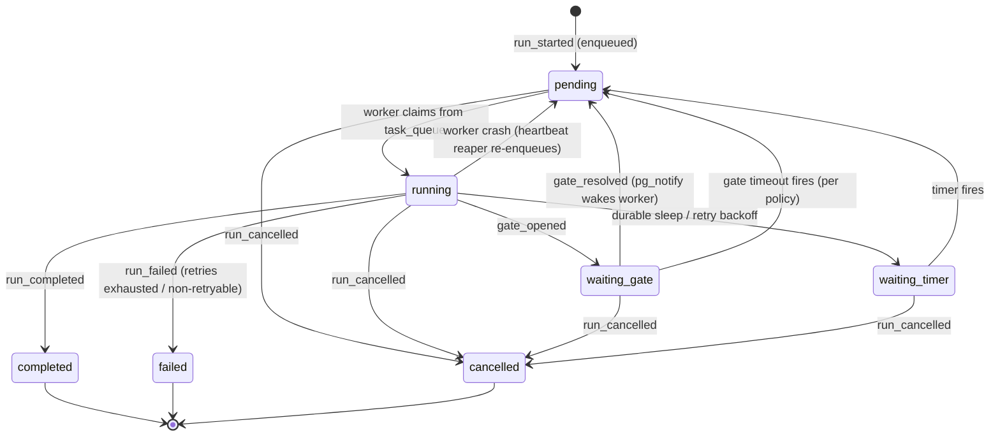
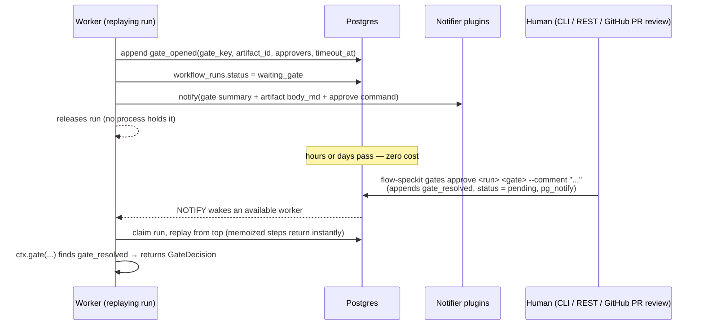

# 03 — Workflow Engine

> The technical heart of Flow SpecKit: a small durable step-memoization engine over a
> Postgres event log. Related ADR: [0002 — build vs embed](adr/0002-build-vs-embed-durable-execution.md).

## 1. Execution model in one paragraph

A workflow is an async Python function whose every side effect goes through checkpointed
`ctx.*` step methods. Progress is recorded as an append-only event log. To run, resume,
or recover a workflow, the engine **replays the function from the top**: any step whose
`step_completed` event exists returns its memoized result instantly; execution proceeds
live from the first un-checkpointed step. A run that is waiting on a human gate or a
timer occupies **no process, no memory, no connection** — it is just rows, until an
event wakes it. This is the DBOS/Restate model, not Temporal's full-history-replay
model: simpler, Postgres-native, and sufficient for SDLC-scale workflows (tens of steps,
days of wall-clock, low concurrency per run).

## 2. Persistence

Two workflow tables plus queue/timers:

```
workflow_events   (run_id uuid, seq bigint, event_type text, payload jsonb,
                   created_at timestamptz, PRIMARY KEY (run_id, seq))
workflow_runs     (run_id uuid PK, workflow_name text, workflow_version text,
                   status text, current_step text, input jsonb,
                   output_ref uuid NULL, error jsonb NULL,
                   created_at, updated_at)
task_queue        (run_id uuid PK, available_at timestamptz, claimed_by text NULL,
                   heartbeat_at timestamptz NULL, attempts int)
timers            (timer_id uuid PK, run_id uuid, step_key text, fire_at timestamptz,
                   kind text)   -- gate timeout | durable sleep | retry backoff
```

`workflow_events` is **the** source of truth — simultaneously durability log, audit
trail, cost ledger, and the feed behind SSE streaming and `flow-speckit runs show --events`.
`workflow_runs` is a rebuildable projection for queries.

### Event types (closed set)

| Event | Payload (essentials) |
|---|---|
| `run_started` | workflow_name, workflow_version, input, actor |
| `step_started` | step_key, step_kind (`skill` \| `execute` \| `gate` \| `sleep` \| `child` \| `intrinsic`) |
| `step_completed` | step_key, result (inline JSON or artifact/blob ref), cost {tokens_in, tokens_out, usd}, duration_ms |
| `step_failed` | step_key, error, attempt, will_retry |
| `gate_opened` | step_key, gate_key, artifact_id, approvers, timeout_at |
| `gate_resolved` | step_key, gate_key, decision (`approved` \| `rejected`), actor, comment |
| `run_completed` | output_ref |
| `run_failed` | error, failed_step |
| `run_cancelled` | actor, reason |

Nine types. Growth here is a design smell; new behavior should compose from these.

## 3. Run lifecycle



`flow-speckit resume <run-id>` is not a special mechanism — it re-enqueues a `pending`/
interrupted run; replay does the rest. Crash recovery and resume are the same code path,
which is why the wedge demo's `kill -9` moment is cheap to keep true.

## 4. Step memoization & determinism

### Step keys

Each `ctx.*` call site gets a deterministic `step_key`: the label passed by the caller
(`ctx.run_skill("shape_product", ...)`) plus an ordinal for repeated labels
(`shape_product#2` on second execution of the same label, e.g. in a feedback loop).
On replay, keys are matched in order; a mismatch between the replayed call sequence and
the event log **fails the run loudly** (`NonDeterminismError`) rather than silently
corrupting state.

### Determinism rules (small, enforced, documented)

Workflow bodies must be deterministic between replays:

- No direct I/O, `datetime.now()`, `random`, `uuid4`, env reads — use `ctx.now()`,
  `ctx.random()`, `ctx.uuid()`, `ctx.config`, which are themselves memoized intrinsic
  steps.
- Plain `if`/`for` over **step results** is safe and encouraged — results are memoized,
  so control flow reproduces exactly.
- Skills and backends may be arbitrarily non-deterministic; only their *results* enter
  the log.

Enforcement: a lint rule (`flow_speckit.lint` ruff plugin, v0.2) flags banned calls in
`@workflow` bodies, and the replay mismatch error catches what linting misses.

### Semantics: at-least-once, stated loudly

A worker can crash after a side effect but before its `step_completed` event commits;
that step will re-execute on recovery. Therefore:

- **Skills** must be idempotent-by-construction (pure functions of inputs; re-running
  produces an equivalent artifact — the store dedups identical `content_hash`).
- **Execution steps** write a durable execution-record marker before dispatch so a
  re-run detects and resumes/discards the orphaned worktree (doc 05 §5).
- **Gate/PR side effects** are naturally idempotent (re-opening an open gate is a no-op;
  PR creation checks for an existing branch→PR first).

We do not pretend exactly-once; the docs and the conformance suites test the retry path
explicitly.

## 5. WorkflowContext (`ctx`) — the whole API

```python
@workflow(name="feature", version="1")
async def feature(ctx: WorkflowContext, idea: str) -> PullRequestArtifact:
    brief    = await ctx.run_skill("frame", input={"idea": idea})
    gate1    = await ctx.gate("brief_approval", artifact=brief, approvers=["role:product"],
                              timeout=timedelta(days=7), on_timeout="fail")
    if gate1.rejected:
        brief = await ctx.run_skill("frame", input={"idea": idea, "feedback": gate1.comment})
        await ctx.gate("brief_approval", artifact=brief, approvers=["role:product"])

    design   = await ctx.run_skill("technical_design", input=brief)
    await ctx.gate("design_approval", artifact=design, approvers=["role:eng-lead"])

    plan     = await ctx.run_skill("task_planning", input=design)
    change   = await ctx.execute("implement", plan=plan, backend="claude-code",
                                 constraints=ExecutionConstraints(timeout=timedelta(hours=2),
                                                                  max_cost_usd=10))
    review   = await ctx.run_skill("code_review", input=change)
    return await ctx.open_pr("open_pr", change=change, review=review)
```

| Method | Step kind | Notes |
|---|---|---|
| `ctx.run_skill(label, input, retry=RetryPolicy(...), timeout=...)` | skill | Resolves skill from registry; result artifact persisted + `derived_from` edges wired before the checkpoint commits |
| `ctx.execute(label, plan, backend, constraints)` | execute | Doc 05; result is a `CodeChange` artifact |
| `ctx.gate(label, artifact, approvers, timeout, on_timeout)` | gate | §6 |
| `ctx.open_pr(label, change, review)` | intrinsic | GitProvider port; result is `PullRequestArtifact` |
| `ctx.sleep(label, duration)` | sleep | Durable timer; run releases the worker |
| `ctx.parallel(steps)` | — | `asyncio.gather` over step coroutines; each memoizes independently |
| `ctx.child_workflow(label, name, input)` | child | New run with `parent_run_id`; parent step completes with child's output ref; cancellation cascades |
| `ctx.now() / ctx.random() / ctx.uuid()` | intrinsic | Memoized determinism helpers |

Retry policy lives on the **step call**, never inside skills:
`RetryPolicy(max_attempts=3, backoff=exponential(base=10s), retry_on=(TransientError,))`.
Backoff between attempts uses a `timers` row (releases the worker), not `asyncio.sleep`.

## 6. Human approval gates — flagship semantics



- `GateDecision` = `{decision, actor, comment, resolved_at}`. **Rejection is a
  first-class outcome**, not an error: workflows branch on it (see the feedback loop in
  §5's example) and the rejection comment becomes skill input — the "gate feedback
  re-shapes the artifact" loop is the core collaboration pattern.
- Approving a gate also sets the referenced artifact's status to `approved`
  (rejected → `rejected`), keeping artifact state and audit log consistent.
- `approvers` is a list of `user:<name>` / `role:<name>` strings matched against config
  (v0.1: any listed identity may resolve; quorum policies like "2 of role:eng-lead" are
  a v0.6 policy hook).
- **Timeouts**: `gate_opened` writes a `timers` row; the scheduler loop fires expired
  timers and applies `on_timeout` — `fail` (default), `approve` (dangerous, explicit),
  or `escalate` (re-notify a second approver list).
- Resolution channels: CLI (v0.1), REST (v0.4), GitHub PR review on the materialized
  artifact file (v0.3), each just appends `gate_resolved`.
- Dev ergonomics: `flow-speckit run --auto-approve` resolves every gate instantly with
  actor `auto` — demoable workflows without ceremony; loudly labeled in the log.

## 7. Dispatch: Postgres-only queue

- **Claim**: `UPDATE task_queue SET claimed_by=$worker, heartbeat_at=now() WHERE run_id
  IN (SELECT run_id FROM task_queue WHERE claimed_by IS NULL AND available_at <= now()
  ORDER BY available_at LIMIT 1 FOR UPDATE SKIP LOCKED) RETURNING run_id` — safe under
  arbitrary worker concurrency.
- **Wakeup**: `LISTEN flow_speckit_wake` + `pg_notify` on enqueue/gate-resolve/timer-fire;
  poll fallback every 5s for missed notifications.
- **Liveness**: workers heartbeat every 15s while executing; a reaper re-enqueues runs
  whose heartbeat is stale > 60s (the crash-recovery path; replay makes it safe).
- **Scheduler loop**: one lightweight task (any worker can host it, guarded by a
  Postgres advisory lock) fires due `timers` rows.

In CLI mode the worker+scheduler run as in-process asyncio tasks; `flow-speckit worker`
runs the identical loop as a standalone process (v0.4). No Redis, no Celery, no broker.

## 8. Authoring: Python DSL canonical, YAML compiled subset

- **Python `@workflow`** is the source of truth and the power path (real conditionals,
  loops, exception handling) — §5 example.
- **YAML templates** cover linear/branching pipelines — what ships in `templates/`:

```yaml
name: review-only
version: "1"
input: { pr_url: str }
steps:
  - skill: fetch_change          # produces CodeChange from an existing PR
    id: fetch
    with: { pr_url: $input.pr_url }
  - skill: code_review
    id: review
    with: { input: $steps.fetch }
  - gate: review_signoff
    artifact: $steps.review
    approvers: [role:eng-lead]
```

The YAML loader compiles to the same step graph the DSL produces — **one engine, zero
YAML-only semantics**. Anything YAML cannot express (loops, exception handling) is the
signal to graduate to Python. Workflows register via the `flow_speckit.workflows` entry
point or project-local `./workflows/`.

### Versioning

`workflow_version` is pinned per run at `run_started`. A changed definition **never
replays against old runs**: in-flight runs keep executing the pinned version (loaded
from the registry by name+version); a changed body under the same version that causes a
replay mismatch fails with `NonDeterminismError` and instructions to bump the version.
This sidesteps Temporal's patch/versioning complexity for a v1 audience; long-lived
in-flight runs across definition changes are explicitly out of scope until demand.

## 9. Cancellation & sub-workflows

- `flow-speckit runs cancel <run-id>` appends `run_cancelled`; workers observe a cancellation
  flag between steps (steps themselves get a bounded grace timeout). In-flight execution
  backends receive terminate signals (doc 05 §5); orphaned worktrees are cleaned.
- Child workflows: cancellation cascades parent → children; a child's failure surfaces
  as the parent's step failure, subject to the parent's retry policy. Compensation is
  explicit workflow logic (branch on failure), not an automatic saga framework.

## 10. Testing the engine (week-one requirements)

- **Golden replay tests**: recorded event logs + workflow bodies asserted to replay to
  identical step sequences.
- **Crash injection**: harness kills the worker between every side-effect/checkpoint
  boundary and asserts recovery converges (at-least-once contract).
- **Non-determinism detection**: mutated bodies must raise `NonDeterminismError`.
- **Gate lifecycle**: open → notify → resolve → resume, including timeout paths.
- **Queue contention**: N workers, M runs, no double-claims (SKIP LOCKED property test).

**Tripwire (ADR-0002):** if these tests aren't rock-solid by the end of the engine
build phase, we adopt DBOS Transact underneath and keep `ctx`/gates as the facade.
