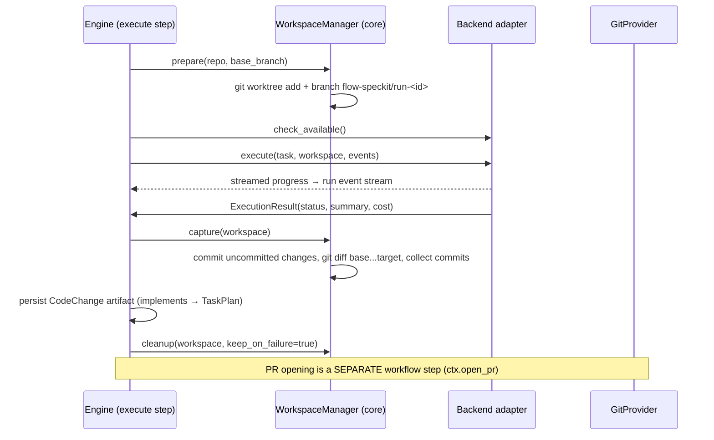

# 05 — Execution Engine

> How Flow SpecKit delegates implementation work to coding agents. The port is kernel; every
> vendor adapter is a plugin. Core owns the workspace so adapters stay ~150 lines.

## 1. The port

```python
class ExecutionBackend(Protocol):
    name: str

    async def check_available(self) -> BackendHealth
        """Preflight: binary on PATH? authenticated? version supported?
        Returns actionable diagnostics, never raises."""

    async def execute(self, task: ExecutionTask, workspace: Workspace,
                      events: ExecutionEventSink) -> ExecutionResult
        """Run the task inside the prepared workspace. May stream progress
        via `events`. Must respect task.constraints. Must be cancellable."""
```

```python
class ExecutionTask(BaseModel):          # rendered FROM the TaskPlan artifact
    instructions: str                    # task spec incl. assembled artifact context
    task_plan_ref: ArtifactRef           # provenance
    constraints: ExecutionConstraints    # timeout, max_cost_usd, allowed_paths,
                                         # network: "inherit" | "none" (docker only)

class Workspace(BaseModel):              # prepared BY core, handed TO the adapter
    path: Path                           # git worktree root
    repo: RepoRef
    base_branch: str
    target_branch: str                   # created by core before execute()

class ExecutionResult(BaseModel):
    status: Literal["completed", "failed", "partial"]
    summary: str                         # backend's own account of what it did
    commits: list[CommitInfo]            # captured by core post-run if backend didn't commit
    diff_ref: BlobRef                    # unified diff base...target, blob-stored
    logs_ref: BlobRef                    # full backend transcript, blob-stored
    cost: CostReport                     # tokens in/out, usd (as reported or estimated)
```

`partial` is a real status: the backend ran out of budget/time with some tasks done.
The workflow decides — retry the remainder, open a gate, or fail.

## 2. Division of labor: core owns the workspace



Adapters only edit files (and optionally commit); core creates the worktree/branch,
captures the diff and commit list uniformly, pushes, and cleans up. This keeps result
shape identical across backends and makes the conformance suite meaningful.

## 3. Shipped backends

| Backend | Package | Mechanism |
|---|---|---|
| `claude-code` (v0.1 flagship) | `flow-speckit-backend-claude-code` | Headless: `claude -p <instructions> --output-format stream-json --permission-mode acceptEdits --max-turns N`, cwd = workspace; parses stream-json for progress + cost; Agent SDK considered as alternative transport within the same adapter |
| `local_shell` (in-core reference) | kernel | Runs a configured command in the workspace (e.g. a script, `make ai-task`, or any CLI). ~60 lines. The always-working demo/CI backend and the template for adapter authors |
| `docker` (in-core wrapper) | kernel | Wraps any backend's command in a container mounting only the workspace; the isolation/`network:none` option |
| `cursor` (v0.3) | `flow-speckit-backend-cursor` | `cursor-agent -p`; exists to prove the port with a second real vendor |

Adapter rot is the expected #1 issue category (vendor CLIs change flags/output/auth on
their own schedule). Mitigations: adapters version and release **independently of
core**; `check_available()` fails with actionable messages before any run starts;
nightly (not per-PR) conformance CI against real CLIs; `local_shell` keeps the framework
demonstrable when every vendor CLI is broken.

## 4. Conformance suite (`flow_speckit.execution.testing`)

Any adapter — first-party or community — must pass against a fixture repo:

1. `check_available` reports honestly (present/absent/unauthenticated cases).
2. Trivial task ("create FILE with CONTENT") → `completed`, correct diff captured.
3. Respects `allowed_paths` (edit outside → detected by core, task marked `failed`).
4. Respects timeout (long task terminated, `partial`/`failed`, workspace intact).
5. Cancellation mid-run terminates the process tree and leaves a capturable workspace.
6. Cost report present (or explicitly `estimated=true`).
7. Crash-rerun: re-executing after a simulated worker crash converges (§5).

## 5. Failure & idempotency semantics

The engine writes an **execution record** (run_id, step_key, workspace path, branch)
*before* dispatching the backend. On re-execution after a crash (at-least-once, doc 03
§4) the step finds the record and: if the branch has commits and the backend supports
resume, resume; otherwise discard the worktree and start clean on a fresh branch suffix.
Orphaned worktrees are listed by `flow-speckit runs show` and cleaned by `flow-speckit gc`.
Cancellation: SIGTERM to the process group, grace period, SIGKILL; workspace preserved
for inspection.

## 6. GitProvider port (repository engine, right-sized)

```python
class GitProvider(Protocol):
    name: str
    async def push_branch(self, workspace: Workspace) -> None
    async def open_pr(self, repo: RepoRef, head: str, base: str,
                      title: str, body_md: str) -> PullRequestInfo
    async def get_pr(self, ref: str) -> PullRequestInfo
    async def list_reviews(self, pr: PullRequestInfo) -> list[ReviewInfo]   # v0.3 gates
```

Kernel ships local-git operations (worktree, branch, diff — used by WorkspaceManager);
`flow-speckit-github` implements the remote surface via `gh` CLI when present, PyGithub as
fallback. PR bodies embed the design/plan artifacts' `body_md` and the `flow-speckit trace`
lineage summary — the PR reviewer sees the full chain of reasoning without leaving
GitHub. GitLab/Bitbucket: post-v1 plugins against this same protocol.

At v0.3, GitHub PR reviews on materialized `.sdlc/` artifact files become a gate
resolution channel: an approving review appends `gate_resolved(approved, actor=<gh
login>)` via webhook or polling — approvals move to where reviewers already live.
